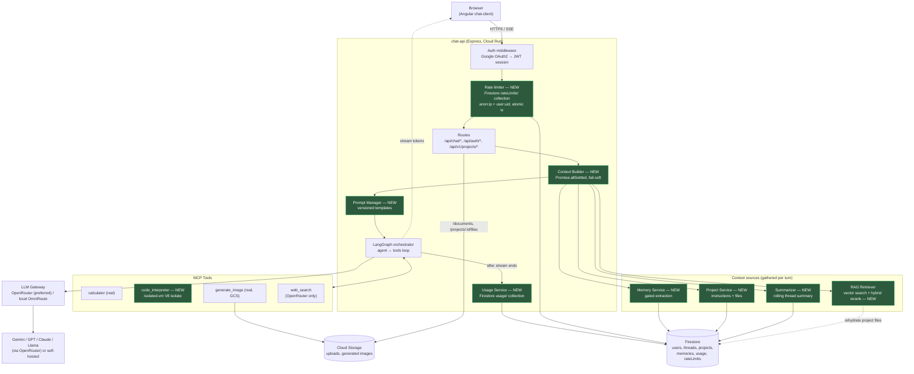
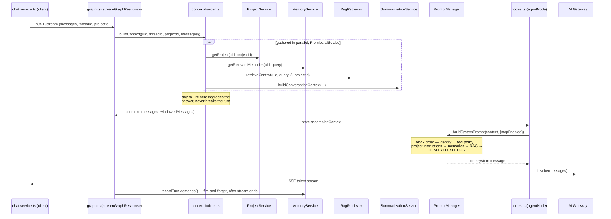
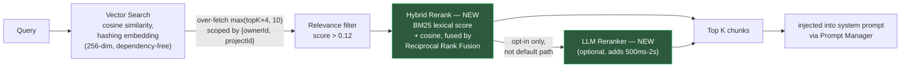
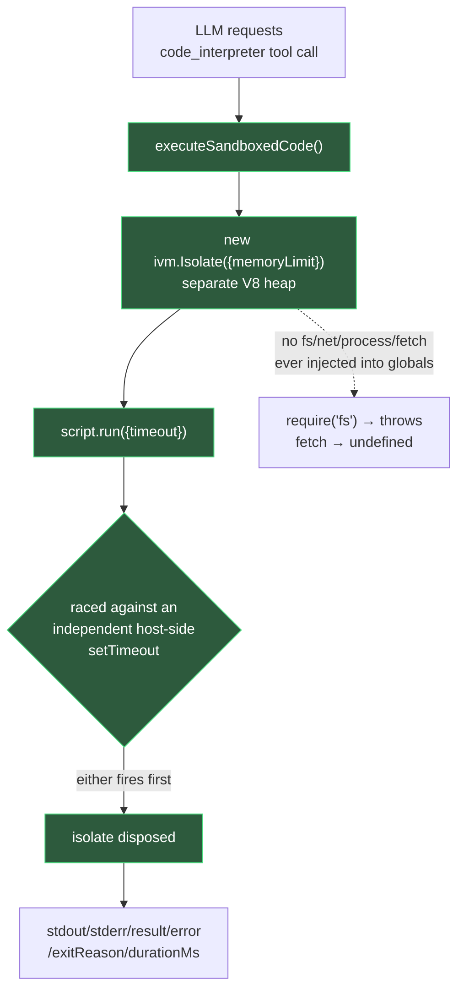
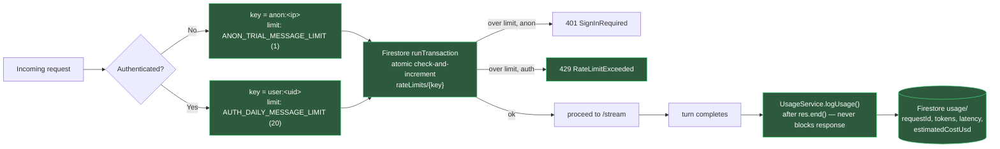

# NexusAI Chat — Architecture

This document reflects the codebase as of the `integration/parallel-agent-batch` branch: the
pre-existing system plus five features (Terraform IaC, sandboxed code execution, RAG reranking,
persistent rate limiting + usage tracking, and Projects/Memory/Summarization/Prompt Manager)
implemented and merged in this session. Nodes marked **NEW** below did not exist before this batch.

Everything described here was independently re-verified against the actual merged source (real
`tsc`/`nx build` compiles, not agent self-reports) — see "Verification" at the bottom.

## 1. System overview

## 2. Context assembly — the core of this session's work

Four features (Projects, Memory, Summarization, Prompt Manager) were deliberately built together
because they all modify the same step: building the system prompt for a turn. Before this batch,
that step was a single inline RAG call; it's now a dedicated pipeline.

## 3. RAG pipeline — Vector Search → Fusion → Reranker → Top K

**Scoping rule:** a document is visible when `ownerId` matches AND (`projectId === null` OR it
equals the conversation's project) — project files never leak outside their project; the personal
knowledge base is visible everywhere. Project files are additionally persisted in Firestore and
re-hydrated into the in-process vector store on first use per server instance, so they survive a
restart — the personal knowledge base does not.

## 4. Code execution sandbox

Isolation is **isolate-level (separate V8 heap), not OS/container-level** — same process/container
as the API server. Stronger than Node's `vm` module (shared heap, no real boundary), weaker than a
dedicated container/VM/gVisor sandbox. The double-timeout exists because `isolated-vm`'s own
timeout only bounds synchronous execution — a script `await`-ing a promise that never resolves
was not reliably killed by it alone during testing.

## 5. Rate limiting & usage tracking

Correctness matters more here than it sounds: the rate limiter it replaced was an in-memory `Map`,
which was not just non-persistent but actually wrong under Cloud Run's multi-instance concurrency
(each instance had its own counter). It also closed a real gap — previously any signed-in user had
**no** limit at all.

## 6. What's implemented in this session — task list

| # | Task | Branch | Status |
|---|------|--------|--------|
| 1 | Terraform IaC scaffold (9 modules × 3 environments) | `feat/terraform-iac-scaffold` | ✅ merged, code-only, nothing provisioned |
| 2 | Sandboxed code execution (`code_interpreter`) | `feat/code-execution-sandbox` | ✅ merged, real isolate-level sandboxing |
| 3 | RAG hybrid reranking (BM25 + cosine via RRF) | `feat/rag-reranking` | ✅ merged |
| 4 | Persistent rate limiting + usage/cost tracking | `feat/rate-limiting-usage-tracking` | ✅ merged |
| 5 | Projects (CRUD + scoped RAG + UI) | `feat/projects-memory-context` | ✅ merged |
| 6 | Long-term memory (gated extraction) | `feat/projects-memory-context` | ✅ merged |
| 7 | Conversation summarization | `feat/projects-memory-context` | ✅ merged |
| 8 | Prompt Manager (versioned templates) | `feat/projects-memory-context` | ✅ merged |

All eight land on `integration/parallel-agent-batch`, currently a local branch (not pushed, not
merged to `main`) — both `chat-api` and `chat-client` build clean on the merged result.

### Not started (deliberately queued, needs your input before starting)

- **Structured response blocks** (typed text/table/code/citation JSON instead of markdown) — touches
  the same streaming contract this batch already changed; should sequence after this merge lands.
- **Multi-tenancy** (`tenantId` isolation) — better done once Projects/Memory schemas are settled,
  which they now are.
- **Observability** (OpenTelemetry/Cloud Trace spans).
- **Managed vector DB swap** (e.g. Vertex AI Vector Search) — needs a provider decision from you,
  since it's a real GCP cost. See §7 — **not required** for anything in this batch to work.

## 7. Configuration — what's required vs. optional

Nothing new in this batch requires a paid or externally-provisioned service. Everything runs on
Firestore (already required) plus in-process state.

| Key / service | Required? | Why |
|---|---|---|
| `GEMINI_API_KEY` | Yes (pre-existing) | Primary model + memory extraction + summarization LLM calls |
| `GOOGLE_CLIENT_ID` | Yes (pre-existing) | OAuth login |
| Firestore | Yes (pre-existing) | Now also backs rate limits, usage records, projects, memories, thread summaries — no new database was introduced |
| `OPENROUTER_API_KEY` | No | Only needed for web_search and multi-provider routing; everything in this batch works on Gemini alone |
| **Vector DB (Pinecone/Weaviate/Vertex AI Vector Search)** | **Not required** | RAG reranking and Projects both build on the existing in-process hashing-embedding store. A managed vector DB would fix "resets on restart," not correctness — it's a scaling improvement, not a dependency |
| **Redis / Memorystore** | **Not required** | Rate limiting and usage tracking are Firestore-backed by design, specifically so no new infra dependency was needed. The Terraform `redis` module is scaffolded (disabled by default) for *future* work only — nothing today calls it |
| **Pub/Sub** | **Not required** | Scaffolded in Terraform for future async ingestion; RAG ingestion today is synchronous and works without it |
| `isolated-vm` (npm package) | Yes, for code execution | No external key — ships prebuilt native binaries, confirmed working on both the Alpine Docker image target and this dev machine with zero compile step |
| `CODE_SANDBOX_TIMEOUT_MS` / `CODE_SANDBOX_MEMORY_MB` | No (has defaults) | Server-side clamps on the sandbox, not client-overridable |
| `ANON_TRIAL_MESSAGE_LIMIT` / `AUTH_DAILY_MESSAGE_LIMIT` / `RATE_LIMIT_WINDOW_HOURS` | No (has defaults) | Rate limit tuning |
| GCS (`GCS_BUCKET_NAME`, `GOOGLE_APPLICATION_CREDENTIALS`) | No (pre-existing, optional) | Only needed for image generation and file-attachment storage URLs; the app degrades to inline data URIs / mock URLs without it — this batch didn't change that |
| Terraform / GCP provisioning | No | The scaffold is code only; nothing was run against real GCP infrastructure this session |

## 8. Known gaps (carried into `.agents/PROJECT_CONTEXT.md`)

- The personal RAG knowledge base is in-process only — resets on restart, not shared across Cloud
  Run instances. Project files are the exception (rehydrated from Firestore).
- The legacy fallback path (`AIRouterService`, used only if the LangGraph call fails before any
  token streams) does not re-apply project instructions/memories/summary, and does not log usage.
- Memory extraction only reads the user's messages — facts the assistant states are never stored.
- `GET /api/chat/usage` needs a Firestore composite index (`userId` ASC + `timestamp` DESC) not
  provisioned anywhere yet — Firestore will surface a console link to create it on first real use.
- Token counts for usage/cost are verified against OpenRouter; unverified against the local
  self-hosted OmniRoute gateway (falls back to explicit `null`, never fabricated, when absent).

## 9. Verification performed this session

Every claim above was checked against the actual merged source, not agent self-reports:

- All five feature branches were merged into `integration/parallel-agent-batch` by hand, resolving
  6 real file conflicts (not auto-merged blindly — one auto-merge silently dropped a branch's
  changes without flagging a conflict, caught by inspecting the result before trusting it).
- `npx nx build chat-api` and `npx nx build chat-client` both run clean on the merged branch, with
  `dist/` output confirmed to contain the new modules (`reranker.js`, `project.service.js`,
  `memory.service.js`, `code-sandbox.js`, `usage.service.js`).
- A separate Nx-daemon bug was found and worked around: building from a git worktree whose
  `node_modules` is a junction to the main checkout silently compiles the main checkout's source
  instead of the worktree's. Every worktree branch was re-verified with a direct `tsc` compile
  (bypassing the daemon) before being trusted.
- `isolated-vm`'s prebuilt binary presence was confirmed directly in `node_modules`, not just cited
  from the agent's report.
