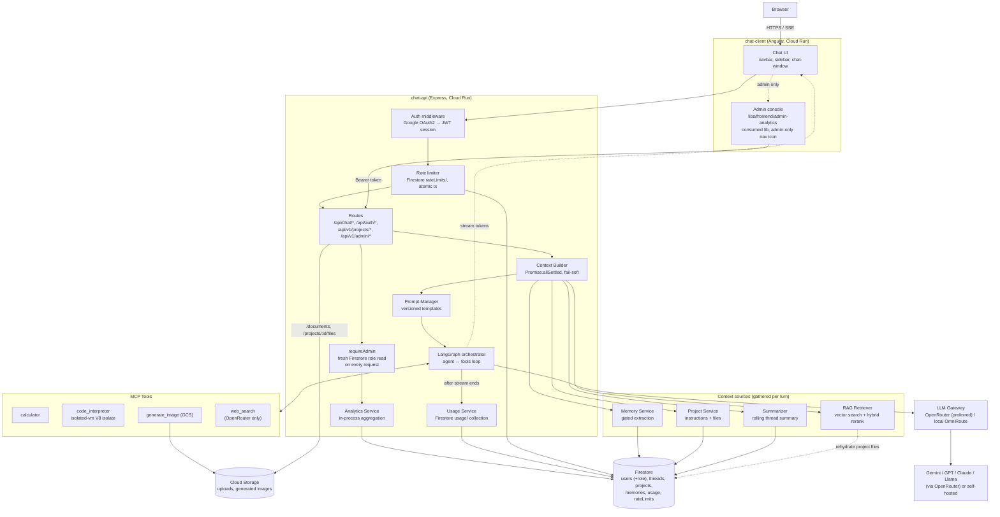
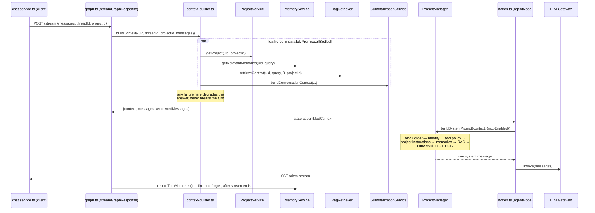
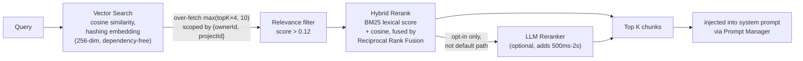
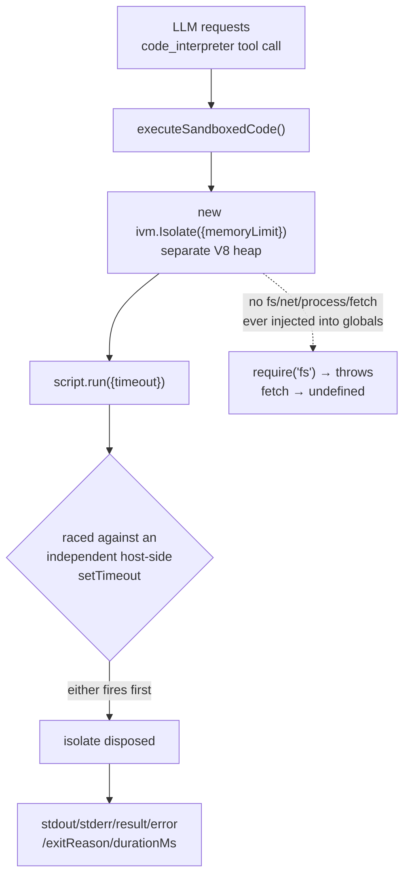
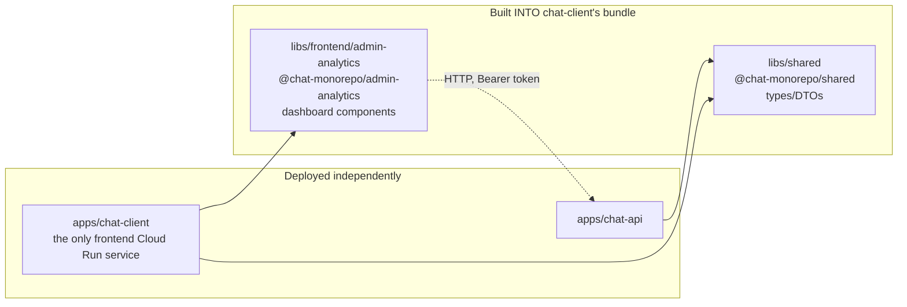
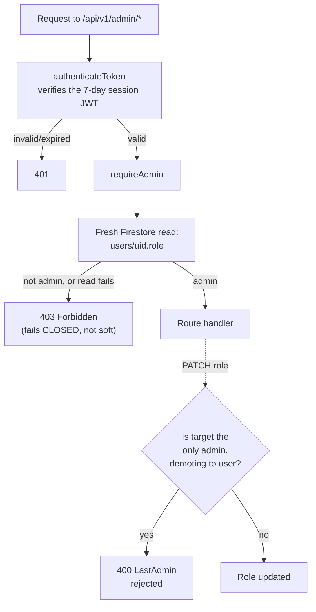
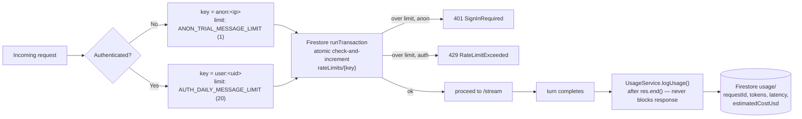

# NexusAI Chat — Architecture

A reference for how the pieces of this system fit together. For setup/deployment instructions, see
[README.md](README.md); for the exhaustive file-by-file internal reference (module by module, every
env var, every known gap), see [`.agents/PROJECT_CONTEXT.md`](.agents/PROJECT_CONTEXT.md) — this
document is the narrative version of the same system.

## 1. System overview

One deployable unit for the frontend, one for the backend — the admin console is a library consumed
directly into chat-client's build (`@chat-monorepo/admin-analytics`, the same mechanism `libs/shared`
already uses for shared types), not a third service. See §5.

## 2. Context assembly — the core of the chat pipeline

Four features share one code path, deliberately, because they all modify the same step: building the
system prompt for a turn.

## 3. RAG pipeline — Vector Search → Fusion → Reranker → Top K

**Scoping rule:** a document is visible when `ownerId` matches AND (`projectId === null` OR it
equals the conversation's project) — project files never leak outside their project; the personal
knowledge base is visible everywhere. Project files are additionally persisted in Firestore and
re-hydrated into the in-process vector store on first use per server instance, so they survive a
restart — the personal knowledge base does not (in-process only, resets on restart, not shared
across Cloud Run instances — a managed vector DB would fix that, but isn't required for correctness).

**Why lexical fusion, not a second embeddings pass:** the hashing embedding isn't a real semantic
model, so re-embedding and comparing again would just reproduce the same cosine ranking with hash
noise. A cheap, independent lexical signal (BM25) is where the actual correction comes from —
verified directly: a short, genuinely on-topic chunk can be outranked by cosine alone by a longer
chunk that happens to repeat common query words (no IDF in the hashing embedding); hybrid reranking
correctly promotes the on-topic chunk back to #1.

## 4. Code execution sandbox

Isolation is **isolate-level (separate V8 heap), not OS/container-level** — same process/container
as the API server. Stronger than Node's `vm` module (shared heap, no real boundary), weaker than a
dedicated container/VM/gVisor sandbox — Cloud Run has no Docker-in-Docker/privileged mode available
for a heavier per-execution sandbox. The double-timeout exists because `isolated-vm`'s own timeout
only bounds synchronous execution — a script `await`-ing a promise that never resolves is not
reliably killed by it alone.

## 5. Frontend — apps that are deployed vs. libs that are consumed

The admin console was deliberately built this way rather than as its own deployable app: one build,
one Cloud Run service, one auth session — no second login, no cross-origin CORS/OAuth-origin
configuration to maintain, no second thing to deploy and keep in sync. The tradeoff is that the lib
can't have its own independent release cadence, which doesn't matter at this scale.

Because a lib can't depend on the app that consumes it (Nx enforces this — `libs/frontend/admin-analytics`
cannot import from `apps/chat-client`), the lib depends on a small injection-token interface instead
(`ADMIN_AUTH_BRIDGE` / `ADMIN_API_BASE_URL`, defined in the lib, provided by chat-client's
`app.config.ts` using its own `AuthService`). This keeps the lib testable/buildable on its own and
avoids a circular architectural dependency.

## 6. Admin console authorization

The role is deliberately **never a JWT claim** — the session token lives 7 days, so baking the role
in would keep a demoted admin privileged for up to a week. `requireAdmin` re-reads Firestore on
every single admin request instead, verified directly: promoting a second account flips their
*already-issued, unchanged* token from 403 to 200 on the very next call, and demoting the original
admin flips theirs from 200 to 403 immediately — no re-login required either way.

This is also the one place in the backend that **fails closed** rather than soft — everywhere else
(§2's context assembly) a Firestore hiccup degrades the answer and keeps going; here a Firestore
error denies access. Getting the first admin account requires a one-time migration script (see
[README.md § Admin Console](README.md#admin-console)); every promotion after that goes through the
console itself, guarded so the last remaining admin can never be demoted (a live safety net — there
is currently exactly one admin).

Usage/cost aggregation (`AnalyticsService`) reads the date-filtered `usage` collection into memory —
Firestore has no server-side GROUP BY. Capped at 20k records scanned per query, with an explicit
`truncated: true` flag surfaced in the dashboard rather than silently showing a partial total as
complete. Fine at current volume; a scheduled BigQuery export is the intended path at real scale
(Firestore for app-level operational data, BigQuery for large-scale analytics).

## 7. Rate limiting & usage tracking

The rate limiter is Firestore-backed rather than an in-memory counter specifically because Cloud Run
runs multiple concurrent instances — an in-memory `Map` isn't just non-persistent, it's actually
wrong under that concurrency model (each instance would have its own counter). It also closed a real
gap: previously any signed-in user had no rate limit at all, only anonymous trial users did.

## 8. Configuration — what's required vs. optional

| Key / service | Required? | Why |
|---|---|---|
| `GEMINI_API_KEY` | Yes | Chat responses, memory extraction, summarization |
| `GOOGLE_CLIENT_ID` / `GOOGLE_CLIENT_SECRET` | Yes | Google Sign-In |
| Firestore | Yes | Threads, projects, memories, rate limits, usage records, user roles — one database backs all of it |
| `OPENROUTER_API_KEY` | No | Enables multi-provider routing, the real `web_search` tool, and image generation. Chat itself works on Gemini alone |
| **Vector DB (Pinecone/Weaviate/Vertex AI Vector Search)** | **Not required** | RAG and Projects run on an in-process hashing-embedding store. A managed vector DB would fix "resets on restart," not correctness |
| **Redis / Memorystore** | **Not required** | Rate limiting and usage tracking are Firestore-backed by design, specifically so no extra infra dependency was needed |
| `isolated-vm` (npm package) | Bundled | No external key — ships prebuilt native binaries, no compile step, for both the Alpine Docker image and typical local dev machines |
| `GCS_BUCKET_NAME` / `GOOGLE_APPLICATION_CREDENTIALS` | No | Image generation and file uploads degrade to inline data URIs / mock URLs without it, rather than failing |
| Terraform / any IaC | No | Removed — infra is managed directly via the `gcloud` commands already in `cloudbuild.yaml`/CI, which was already the real deployment path even when a Terraform scaffold briefly existed alongside it |

Full env var reference with defaults: [`.env.example`](.env.example).

## 9. Known gaps

- The personal RAG knowledge base is in-process only — resets on restart, not shared across Cloud
  Run instances. Project files are the exception (rehydrated from Firestore on first use).
- The legacy fallback path (`AIRouterService`, only reached if the LangGraph gateway call fails
  before any token streams) doesn't re-apply project instructions/memories/summary, and doesn't log
  usage.
- Memory extraction only reads the user's own messages — facts the assistant states are never
  stored.
- `GET /api/chat/usage` needs a Firestore composite index (`userId` ASC + `timestamp` DESC) not
  provisioned anywhere yet — Firestore will surface a console link to create it on first real use.
  (The admin analytics API deliberately avoids this shape — timestamp-only queries, filtered further
  in-process — specifically so it doesn't need one.)
- Token counts for usage/cost are verified against OpenRouter; unverified against a local
  self-hosted OmniRoute gateway (falls back to explicit `null`, never fabricated, when absent).
- Admin usage aggregation is in-process and capped (see §6) — not a design that scales past a
  moderate request volume without a BigQuery export.

## 10. How this codebase verifies changes

Not a formal test suite (there isn't one yet) — the working practice has been: real builds from a
clean cache (`rm -rf dist .nx/cache`, `nx run-many -t build`) rather than trusting incremental
build/cache state, and for anything security- or behavior-sensitive (the admin authorization
boundary, the chat auto-scroll logic, RAG reranking quality), a live check against the running
system — real HTTP requests with real tokens against real data, or a real browser session — rather
than reasoning about the code in the abstract. Claims in this document and in
`.agents/PROJECT_CONTEXT.md` reflect that: verified behavior, not just what the code appears to do.
